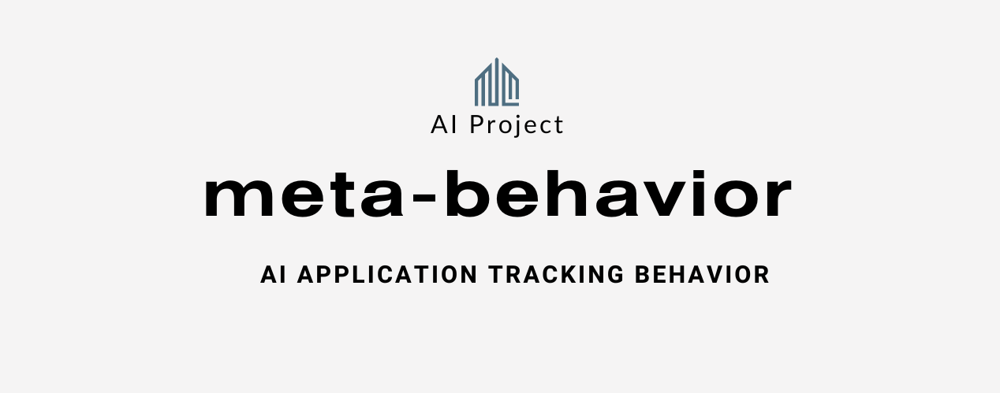
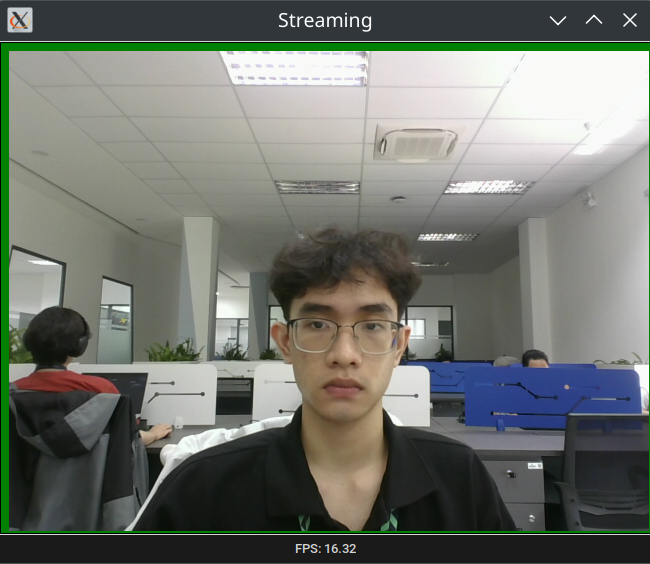
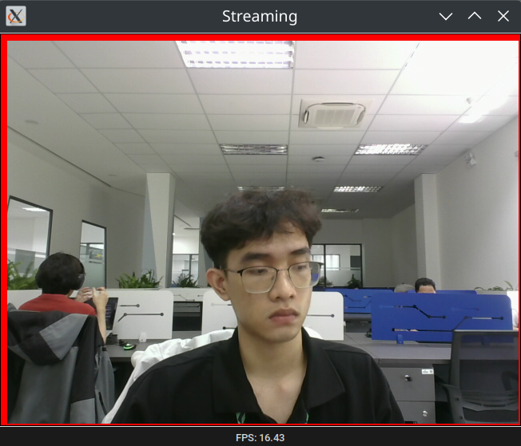

<div align="center">
  <p>
    <a href="https://yolovision.ultralytics.com/" target="_blank">
      </a>
  </p>

<br>

This is the application using to detect focusion through camera

</div>




## <div align="center">Installation</div>
  ```bash
  pip install -r requirements.txt
  ```


## <div align="center">Usage UI</div>
  ```bash
  python ui.py
  ```


## <div align="center">Usage API</div>
  ```bash
  python api.py
  ```
## <div align="center">Usage Docker</div>
  ```bash
  docker-compose up
  ```
